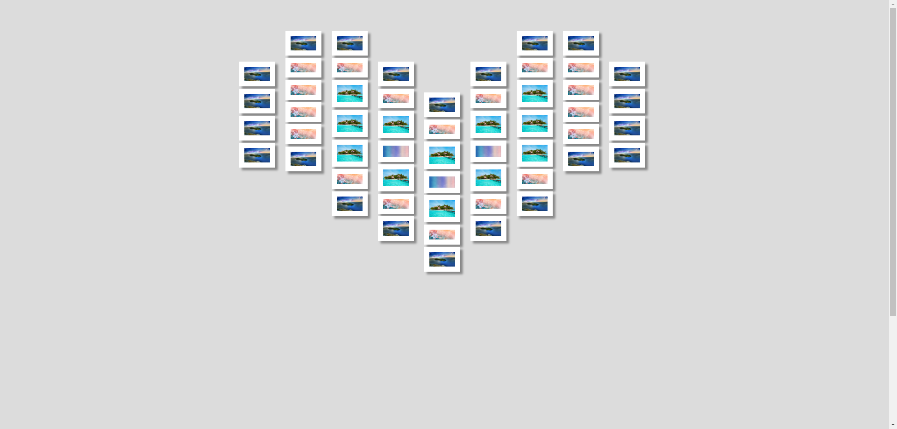

  <a title="English" href="/README_English.md">English</a>

# 项目介绍
本项目收集有趣的前端特效网页源码，有游戏，祝福特效等

| 目录 | 描述 |
| ---------------------| -------------- |
| fireworks_effects           | 简单的粒子烟花特效 |
| font_of_fireworks             | 字体粒子烟花特效，可以添加文字 |
| fruit_slice         | 水果忍者网页版 |
| love_photo_wall   | 爱心照片墙 |
| love_tree          | html5唯美爱情表白动画网页代码，可以配置背景音乐|
| mother's_day       | 母亲节 爱心树祝福网页 |
| NewYearFirework       | 新年快乐烟花祝福网站，有祝福文字特效 |
| shuffling_photo_album| 照片墙 合集 |
| texiao    | 粒子特效 |
| xiangqi    | 中国象棋 |

# 运行效果
## 点击标题预览

###  [fireworks_effects](https://blog.hongmaple.top/StaticWebComponents/fireworks_effects)

### [font_of_fireworks](https://blog.hongmaple.top/StaticWebComponents/font_of_fireworks)

### [fruit_slice](https://blog.hongmaple.top/StaticWebComponents/fruit_slice)

### [love_photo_wall](https://blog.hongmaple.top/StaticWebComponents/love_photo_wall)

### [love_tree](https://blog.hongmaple.top/StaticWebComponents/love_tree)

### [NewYearFirework](https://blog.hongmaple.top/StaticWebComponents/NewYearFirework)

### texiao
#### [live_sg](https://blog.hongmaple.top/StaticWebComponents/live_sg)

### [xiangqi](https://blog.hongmaple.top/StaticWebComponents/xiangqi)

## 联系我
wx: mapleCx331   qq群：

## 开源不易，谢谢打赏
<table>
 <td>
   <td></td>
   <td></td>
 </td>
</table>